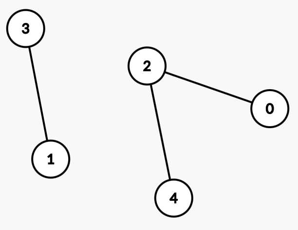
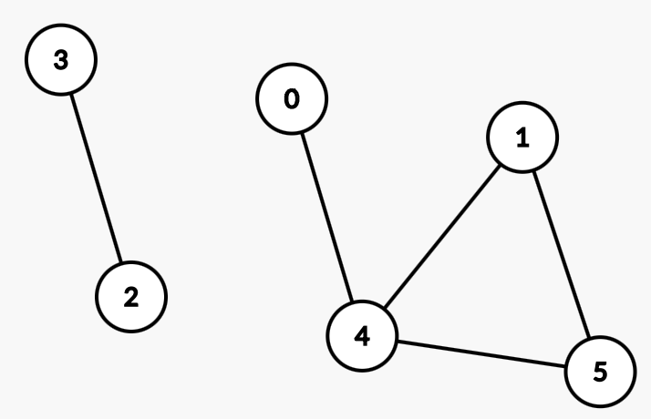

# Задачи
## Редица
### https://www.geeksforgeeks.org/next-greater-element/
Имате редица от числа. Намерете за всяко число кое е следващото по-голямо от него в редицата. Ако няма такова изведете -1

Пример

    1 2 3 4 3 2 1 2

    1 -> 2
    2 -> 3
    3 -> 4
    4 -> -1
    3 -> -1
    2 -> -1
    2 -> 2
    2 -> -1

## Портокали
### https://www.geeksforgeeks.org/minimum-time-required-so-that-all-oranges-become-rotten/
Дадена е касетка с портокали. На някои места има портокали, на някои няма. Някои портокали са развалени. Развалените портокали могат да развалят съседните на тях, като това се случва за една единица време. Намерете колко време ще отнеме на всичките портокали да се развалят. Ако това не е възможно изведете -1.

Пример

b - развален портокал

g - неразвален портокал

x - няма портокал

    b | g | x | b | g 
    g | x | g | b | g
    g | x | x | b | g
    
    2
---

    g | g | x | b | g 
    g | x | g | b | g
    g | x | x | b | g

    -1

## Цикъл в граф

По подаден граф намерете дали в него има цикъл.

Първо се въвеждат две числа - Н и М, които са съответно броя върхове и броя ребра в графа. Следват М реда с две числа - между кои два върха има ребро.

Пример

    6 3
    0 4
    2 3
    4 5

    false
---

    6 4
    0 4
    2 3
    4 5
    1 5
    1 4

    true
